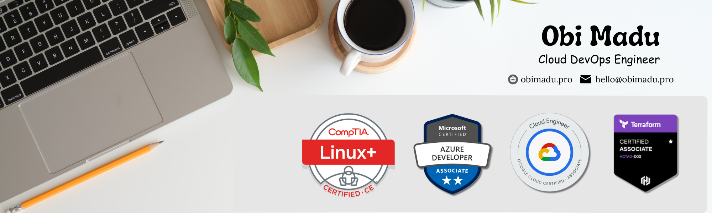

# Hey, I'm Obi 👋

AI Engineer & Technical Founder. I build production AI-native products across the full SDLC — from React Native mobile apps to FastAPI backends to cloud infrastructure. Currently shipping autonomous multi-agent systems in finance, cybersecurity, and consumer AI, with a deep infrastructure foundation in Kubernetes, Terraform, and self-hosted AI inference. Founded two companies, led teams of 25+, and keep things at 99%+ uptime.   

## 🛠 Tools and Technologies

Group | Badges
--- | ---
**Languages** |     
**AI & LLMs** |      
**Frontend & Mobile** |    
**Databases** |    
**Infrastructure & IaC** |     
**CI/CD & Version Control** |   
**Monitoring & Observability** |    
**Cloud** |   

 

## 📜 Certifications
✅ Google Cloud Certified: Associate Cloud Engineer

✅ HashiCorp Certified: Terraform Associate (003)

✅ Microsoft Certified: Azure Developer Associate

✅ CompTIA Linux+ ce

## 🔗 Connect with Me
  

Let's build AI-native things together.

<!--

## 💻 Stats

-->
